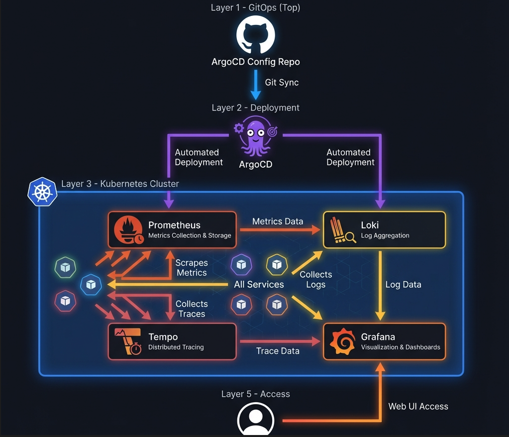

# Observability Platform with Argo CD, Prometheus, and Grafana

This project aims to build a comprehensive observability platform using GitOps principles with Argo CD.



## Components

- **Argo CD**: Declarative, GitOps continuous delivery tool for Kubernetes.
- **Prometheus**: Monitoring system and time series database.
- **Grafana**: Analytics and interactive visualization web application.
- **Alertmanager**: Handles alerts sent by client applications such as Prometheus.
- **Loki**: Horizontally-scalable, highly-available, multi-tenant log aggregation system.
- **Tempo**: Distributed tracing backend.

## Structure

- `argocd/`: Configurations for Argo CD itself.
- `apps/`: Argo CD Application manifests (The "App of Apps" or individual apps).
- `observability/`:
  - `prometheus/`: Prometheus specific configurations.
  - `grafana/`: Grafana specific configurations.

## Usage

1. **Install Argo CD**:
   ```bash
   make install-argocd
   ```

2. **Deploy Observability Apps**:
   ```bash
   make apply-apps
   ```

3. **Get Passwords**:
   ```bash
   make get-passwords
   ```

4. **Access Interfaces**:
   - **Argo CD**: `make port-forward-argocd` (http://localhost:8080)
   - **Grafana**: `make port-forward-grafana` (http://localhost:3000)
   - **Prometheus**: `make port-forward-prometheus` (http://localhost:9090)

## Prerequisites

- A Kubernetes cluster (Minikube, Kind, Docker Desktop, or remote).
- `kubectl` installed.

